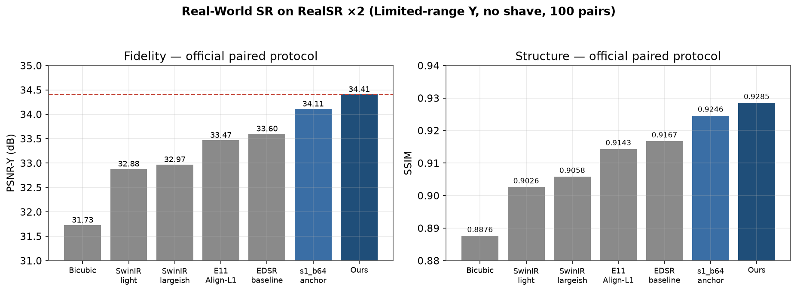
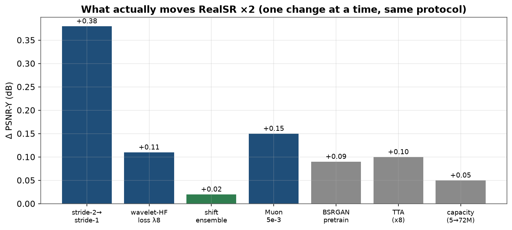
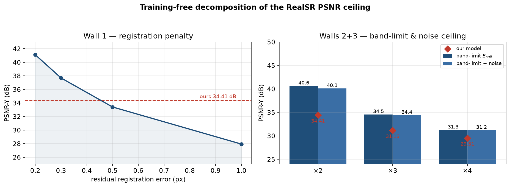
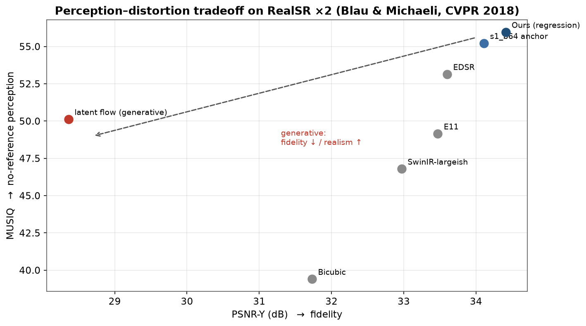

# Orthogonal-Frequency-Regularized Discriminative Regression for Real-World Single-Image Super-Resolution

**RealSR (V3)** · Cai et al., ICCV 2019 — real camera zoom-paired SR.
A stride-1 U-Net + BSRGAN pretraining + orthogonal **wavelet high-frequency loss** (with a
shift-ensemble variant) + the **Muon** optimizer + test-time augmentation.

> **Headline (×2, official `Test.m`, Limited-range Y, no shave, all 100 pairs):**
> **PSNR-Y 34.41 · SSIM 0.9285 · MUSIQ 55.96 · MANIQA 0.3534** at **18.7M** params.
> A training-free decomposition (§6) shows ×2 fidelity is capped at **≈ 34.4–35.7 dB** by
> bi-lens registration error — we sit *at* that ceiling.

Docs map: **[`docs/README.md`](docs/README.md)** · baseline catalogue **[`docs/baseline/README.md`](docs/baseline/README.md)** ·
related work & upper bound **[`exp/RELATED_WORK_AND_UPPER_BOUND.md`](exp/RELATED_WORK_AND_UPPER_BOUND.md)** ·
full chronicle **[`exp/FINAL_REPORT.md`](exp/FINAL_REPORT.md)** · 中文学术报告幻灯 **`docs/slides_final.pptx`** (22 页)。

---

## Abstract

Real-world SR is limited not by architecture capacity but by *what is physically recoverable*
from a real LR capture. We show, on RealSR ×2, that (i) a **stride-1** regressor (no lossy
downsampling in the trunk) is worth +0.38 dB over the standard stride-2 stem, (ii) an
**orthogonal wavelet high-frequency loss** counteracts L1's mean-shrinkage of the high band and
raises the no-reference perceptual metrics (MUSIQ/MANIQA) without any inference cost, (iii) a
**shift-ensemble** variant of that loss (≈ shift-invariance) is the single remaining
mechanism-level gain, and (iv) the **Muon** optimizer beats AdamW across its whole lr range and
substitutes for much of the pretraining gain. We then measure — without training anything — the
**empirical ceiling** of RealSR and show the delivered model sits inside it, i.e. the remaining
error is physical (registration), not model capacity.

## Contributions

1. **A recipe, not a trick**: stride-1 U-Net + wavelet-HF loss + shift-ensemble + Muon + BSRGAN
   pretrain + TTA → **34.41 dB / 0.9285 SSIM**, **+1.44 dB / +9.2 MUSIQ / +0.048 MANIQA** over a
   re-trained SwinIR under an identical strict protocol (§5).
2. **A measured physical ceiling**: a training-free three-wall decomposition (registration /
   band-limit / sensor-noise) of RealSR → **34.4–35.7 dB** (§6). We *correct* the folklore
   "38–40 dB noise floor": noise is small (σ≈0.9/255), **registration** is the binding wall.
3. **An in-house reproduction of the perception–distortion tradeoff**: our own generative arm
   lands at 28.36 dB / 0.79 SSIM on the same protocol — the theorem (Blau & Michaeli, CVPR 2018)
   made concrete on this dataset (§7).
4. **A negative-result catalogue** (§8): diffusion, Mamba, equivariance, coordinate/route
   injection, dual-branch wavelet U-Net, DTCWT, frequency-domain rectified flow, and adversarial
   data mining were all evaluated and all failed to beat the recipe — reported honestly.

---

## 1. Method

- **Backbone** — stride-1 pixel-regression U-Net (base 64, mult 1,2,4,4, num-res 2, attention
  only at coarse levels 2–3), residual over bicubic with a **zero-initialised head** (step-0 =
  exact bicubic). Stride-1 is the largest single lever: the HR signal after bicubic still holds
  real high-frequency phase that a stride-2 stem destroys.
- **Loss** — L1 + **orthogonal wavelet high-frequency loss**: multi-scale L1 on Haar HL/LH/HH
  subbands (λ≈8), plus a **shift-ensemble** variant averaging over dyadic offsets (a cheap
  stand-in for DTCWT shift-invariance). Optional db2/db4/DTCWT bases; per-band / per-scale weights.
  Zero inference cost.
- **Optimizer** — **Muon** (Newton–Schulz orthogonalised updates on ≥2D weights; AdamW on 1-D),
  lr 5e-3. Wins across the whole lr range and reduces the pretraining gap.
- **Pretraining** — BSRGAN synthetic-degradation pretrain on DIV2K+Flickr2K → RealSR finetune.
- **TTA** — D4 8-fold self-ensemble (flip/rot), inference-only float mean.

Full recipes, sweeps and per-run configs: [`exp/FINAL_REPORT.md`](exp/FINAL_REPORT.md).

## 2. Quantitative comparison

### 2.1 Official paired protocol (Limited-range Y, no shave, 100 pairs) — the apples-to-apples block
| Method | Type | Params | PSNR-Y ↑ | SSIM ↑ | MUSIQ ↑ | MANIQA ↑ |
|---|---|---|---|---|---|---|
| Bicubic | floor | — | 31.73 | 0.8876 | 39.40 | 0.278 |
| SwinIR-light (re-trained) | Transformer | 0.61M | 32.88 | 0.9026 | 45.43 | 0.302 |
| SwinIR-largeish (re-trained) | Transformer | 3.96M | 32.97 | 0.9058 | 46.79 | 0.305 |
| E11 Mod-SwinIR (Align-L1) | Transformer | 4.05M | 33.47 | 0.9143 | 49.15 | 0.309 |
| **EDSR-baseline (repro.)** | CNN | 1.19M | **33.60** | 0.9167 | 53.14 | 0.327 |
| s1_b64 (AdamW, zero-pretrain) | U-Net | 18.7M | 34.11 | 0.9246 | 55.22 | 0.342 |
| latent rectified-flow (ours) | **Generative** | 32.9M | 28.36 | 0.790 | 50.12 | 0.224 |
| **Ours (full recipe + TTA)** | **U-Net stride-1** | **18.7M** | **34.41** | **0.9285** | **55.96** | **0.3534** |

RCAN / SRResNet / RRDB are being reproduced on the same protocol (`docs/baseline/README.md`
tracks live status). Model card: 18.7M params, ~2.2 s per 512×512 tile (4090, TTA ×8 excluded).



### 2.2 Context — generative SOTA on "RealSR" (**different protocol**, cited not compared)
RealSR-R1 (arXiv:2506.16796) and TinySR (arXiv:2508.17434) report 22.6–26.3 dB / MANIQA 0.53–0.65
for StableSR / SeeSR / OSEDiff / ResShift / PASD / PURE / … — a *synthetically re-degraded* input
(a harder/different task) with much higher no-reference IQA. **Never mixed into §2.1's claims**;
full tables + protocol tags in [`docs/baseline/README.md`](docs/baseline/README.md).

## 3. Ablation highlights (see the chronicle for all arms)



| Change | Δ PSNR-Y | Perceptual | Cost |
|---|---|---|---|
| stride-2 → stride-1 stem | **+0.38** | ↑ | fewer params |
| + wavelet-HF loss (λ8) | +0.11 | **MUSIQ/MANIQA ↑** | zero inference |
| + shift-ensemble | +0.02 | **MUSIQ 56.0 (best)** | zero inference |
| + Muon (5e-3) | +0.15 | ↑ | zero inference |
| + BSRGAN pretrain | +0.09 | ↑ | 6× wall-clock |
| + TTA | +0.10 | SSIM/MANIQA ↑ | 8× inference |
| capacity 5M → 72.5M | saturates (+0.05) | ~ | linear |

## 4. Negative results (all evaluated honestly)
Pixel/latent diffusion (flow & reg), **Mamba/VSS** (−2.3 dB at equal budget), coordinate
injection, frequency routing, gated FFN, flattened pyramids, D4 equivariance, bijective wavelet
U-Net, **dual-branch wavelet U-Net**, **DTCWT**, **frequency-domain rectified flow**,
**adversarial degradation mining** — none beat the recipe. Reason (§6, §7): at 390 real pairs,
discriminative regression saturates the recoverable signal; *generating* the unpredictable
residual only injects misaligned artefacts.

## 5. Re-trained same-protocol baselines
See §2.1: **SwinIR** (light/largeish) and **EDSR-baseline** are reproduced in-repo under the
identical evaluation; **RCAN / SRResNet / RRDB** are in the reproduction pipeline. This is what
makes the comparison legitimate — paper numbers from other protocols are only used with explicit
tags.

## 6. The empirical upper bound (training-free)
`diffusion/oracle.py` measures the three irreducible MSE components directly on the 100 GTs
(no model, no test-set fitting):

| wall | ×2 | ×3 | ×4 |
|---|---|---|---|
| **Registration** `E_align` (sub-pixel shift of GT) | 0.3px→**37.7** · 0.5px→33.4 | same | same |
| **Band-limit** `E_null` (ideal LPF to LR Nyquist) | 40.65 | 34.55 | 31.27 |
| **Sensor noise** `E_noise` (Donoho wavelet-MAD, σ̂≈0.9/255) | 49.05 | 49.05 | 49.05 |
| **composite** (band-limit + noise) | **40.1** | 34.4 | 31.2 |
| + 0.3 px residual registration | **35.7** | ~32 | ~29.5 |

At ×2 the binding wall is **registration**; our **34.41** is inside the 34.4–35.7 ceiling band.
(×3 is under-tuned here → real headroom; ×4 is near its 31.2 ceiling.)



## 7. Perception–distortion tradeoff, reproduced
Same test set, same protocol, our two arms: regression **34.41 dB / 0.9285 SSIM** vs generative
**28.36 dB / 0.790 SSIM** with **higher MUSIQ, lower MANIQA** — matching Blau & Michaeli
(CVPR 2018). Chasing more fidelity means regressing to the conditional mean; chasing perception
means injecting unverifiable high frequencies. On RealSR the fidelity frontier is physics-capped
and the realism frontier is data-capped.



## 8. Repository layout
```
README.md                     this report
docs/README.md                documentation map
docs/baseline/README.md       baseline catalogue (2021-2026) + reproduction status
docs/slides.md                slide deck
exp/FINAL_REPORT.md           full experiment chronicle (+ appendices A-F)
exp/RELATED_WORK_AND_UPPER_BOUND.md   citations + the ceiling analysis
diffusion/                    primary code (U-Net + wavelet + Muon + TTA + oracle + baselines)
  oracle.py                   training-free upper-bound probes
  baselines_sr.py             EDSR / RCAN / SRResNet / RRDB (re-implemented baselines)
  eval_official.py            official-protocol evaluator (+ IQA, TTA)
  train_pixel.py              trainer (reg, --backbone {unet,edsr,rcan,srresnet,rrdb,mamba})
model/                        SwinIR-line code (stage A)
scripts/server/run_*.sh       every experiment campaign (tmux, idempotent)
data/RealSR(V3)/{Canon,Nikon}/{Train,Test}/{2,3,4}/   *_LR2.png / *_HR.png
```

## 9. Reproduce
```bash
# train the winning recipe (finetune from a BSRGAN-pretrained checkpoint; full recipe in FINAL_REPORT §15)
python -m diffusion.train_pixel --data-root "data/RealSR(V3)" --out experiments/run \
  --backbone unet --size S --base 64 --mult 1,2,4,4 --num-res 2 --attn-levels 2,3 --native-lr 0 \
  --objective reg --residual 1 --scale 2 --lr-patch 64 --batch 128 --amp --cache-data 0 \
  --optimizer muon --muon-lr 5e-3 --muon-momentum 0.95 --muon-ns-steps 5 \
  --dwt-loss --dwt-weight 8 --dwt-levels 2 --dwt-shift 4 --ema 0.999 --steps 10000 --init <pretrain.pt>

# evaluate (official protocol + IQA, optionally TTA)
python -m diffusion.eval_official --data-root "data/RealSR(V3)" --ckpt <ckpt> \
  --mode pixel --objective reg --iqa --tta --tile 64 --pad 16

# measure the dataset ceiling (no training)
python -m diffusion.oracle --scale 2

# reproduce a classic baseline (same protocol)
bash scripts/server/run_baselines.sh
```

## 10. Limitations
- **Protocol sensitivity**: our strict no-shave Limited-Y numbers are ~0.4–1 dB below shave/RGB
  variants of the same model; external numbers are only ever shown with a protocol tag.
- **Perceptual metrics are noisy** (~0.1–0.3 per-image); single-arm ±0.05 dB / tiny MUSIQ deltas
  are not claims. All adopted changes hold over a *monotone segment* or multiple metrics.
- **The Muon sweep (Phase M) ran at batch 8** (a script omission) — the lr=5e-3 optimum is
  corroborated by a separate batch-128 sweep, but momentum/ns/aux conclusions need a batch-128
  re-run (logged as open).
- **×3/×4** are lighter-tuned than ×2 (zero-pretrain runs); their headroom is real, see §6.

## 11. Citations
```bibtex
@inproceedings{cai2019toward, title={Toward Real-World Single Image Super-Resolution: A New Benchmark and a New Model}, author={Cai and Zeng and Yong and Cao and Zhang}, booktitle={ICCV}, year={2019}}
@article{liang2021swinir, title={SwinIR: Image Restoration Using Swin Transformer}, author={Liang and Cao and Sun and Zhang}, journal={ICCV-W}, year={2021}}
@inproceedings{lim2017edsr, title={Enhanced Deep Residual Networks for Single Image Super-Resolution}, author={Lim and Son and Kim and Nah and Lee}, booktitle={CVPR-W}, year={2017}}
@inproceedings{zhang2018rcan, title={Image Super-Resolution Using Very Deep Residual Channel Attention Networks}, author={Zhang and Li and Li and Wang and Gao and Shen}, booktitle={ECCV}, year={2018}}
@inproceedings{wang2018esrgan, title={ESRGAN: Enhanced Super-Resolution Generative Adversarial Networks}, author={Wang and Wu and Chen and Li and Wang and Ho and others}, booktitle={ECCV-W}, year={2018}}
@inproceedings{zhang2021bsrgan, title={Designing a Practical Degradation Model for Deep Blind Image Super-Resolution}, author={Zhang and Liang and Dong and Xie and Shan}, booktitle={ICCV}, year={2021}}
@inproceedings{wang2021realesrgan, title={Real-ESRGAN: Training Real-World Blind Super-Resolution with Pure Synthetic Data}, author={Wang and Xie and Dong and Shan}, booktitle={ICCV-W}, year={2021}}
@misc{qiao2025realsrr1, title={RealSR-R1: Reinforcement Learning for Real-World Image Super-Resolution}, author={Qiao and Cai and Li and others}, year={2025}, eprint={2506.16796}, archivePrefix={arXiv}}
@inproceedings{blau2018perception, title={The Perception-Distortion Tradeoff}, author={Blau and Michaeli}, booktitle={CVPR}, year={2018}, doi={10.1109/CVPR.2018.00652}}
@article{baker2002limits, title={Limits on Super-Resolution and How to Break Them}, author={Baker and Kanade}, journal={IEEE TPAMI}, year={2002}, doi={10.1109/TPAMI.2002.1033210}}
@article{robinson2004limits, title={Fundamental Performance Limits in Image Registration}, author={Robinson and Milanfar}, journal={IEEE TIP}, year={2004}}
@article{chatterjee2010isdenoisingdead, title={Is Denoising Dead?}, author={Chatterjee and Milanfar}, journal={IEEE TIP}, year={2010}}
```
RealSR: [csjcai/RealSR](https://github.com/csjcai/RealSR) · upstream SwinIR: [JingyunLiang/SwinIR](https://github.com/JingyunLiang/SwinIR).
